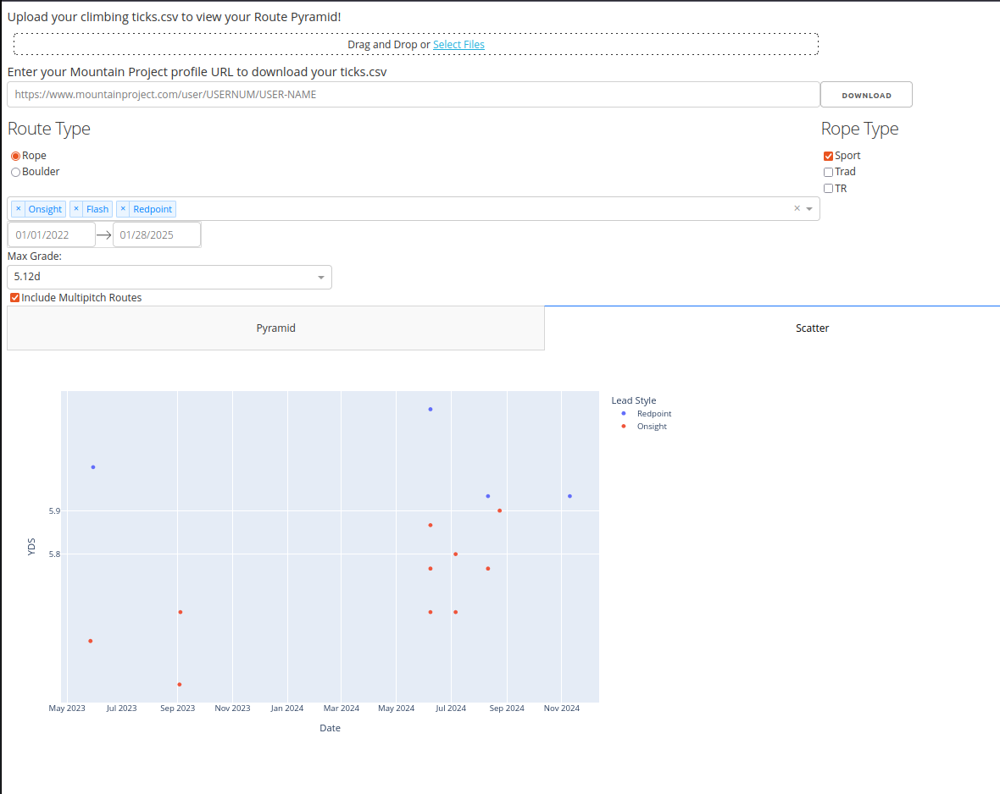

# Climbing Pyramid Visualizer



## Current Requirements

You need an environment which can run `python`, such as a `conda` environment.

In addition, you will need to install the following packages:

* `pandas`
* `plotly`
* `streamlit`
* `statsmodels`

All of which can be installed via `conda` or `mamba`.

```
mamba create -n climb python=3.11 pandas plotly streamlit statsmodels
```

## To run

To run the app, simply run the following command in the terminal:

```
streamlit run app.py
```

Then a browser window will open with the app running.

## Generate standalone HTML with stlite

To generate a standalone HTML file, run the following command in the terminal:

```
python generate-stlite.py
```
This will generate a file called `index.html` that uses [stlite](https://github.com/whitphx/stlite) to run the app in a standalone HTML file.


### TODO
Make the other route types work, currently only the "Rope" and "Boulder" routes work. The others have the correct rating codes in the `GRADES` dictionary, but no functionality in the app yet.
