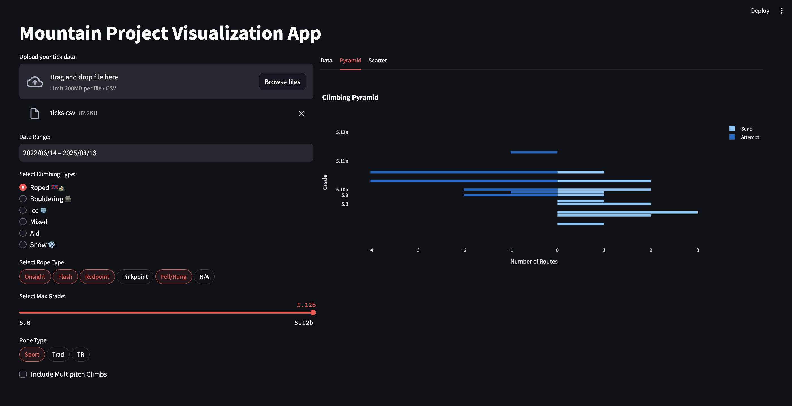

# Climbing Pyramid Visualizer



## Current Requirements

You need an environment which can run `python`, such as a `conda` environment.

In addition, you will need to install the following packages:

* `pandas`
* `plotly`
* `dash`

All of which can be installed via `pip`.

```
mamba create -n climb python=3.11 pandas plotly dash
```

## To run

To run the app, simply run the following command in the terminal:

```
HOST=localhost
python app.py
```

Then simply run the app via the terminal with `./app.py` (you will need to copy/paste the URL into a web browser).
